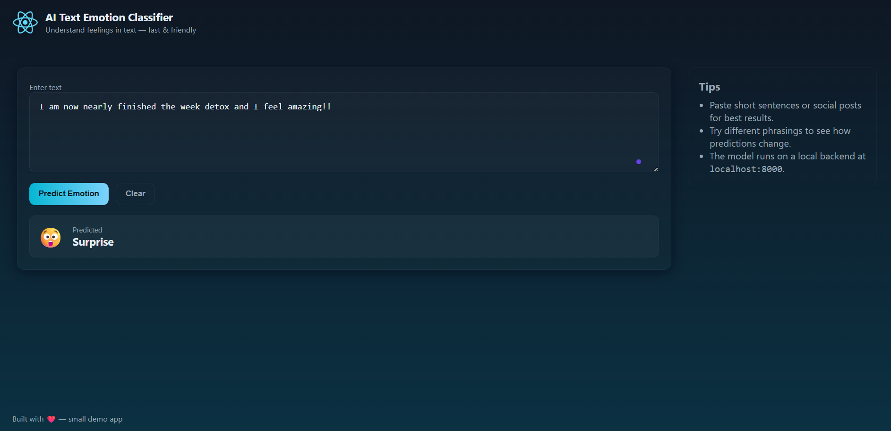

# AI Text Emotion Classifier 🤖💬


**AI Text Emotion Classifier** is a web application that uses machine learning to detect emotions in text. Powered by FastAPI and Python, it provides a simple API for emotion prediction and can be easily integrated into other apps or used for research.

---

## ✨ Core Features

- **🧠 Emotion Detection**: Predicts emotions (e.g., joy, sadness, anger, fear) from user input text
- **⚡ FastAPI Backend**: High-performance REST API for emotion classification
- **📊 Ensemble Model**: Combines deep learning (BiLSTM) and classical ML (Naive Bayes) for robust predictions
- **🔒 Robust Error Handling**: Graceful API responses for invalid input
- **📝 Easy Integration**: Simple endpoints for quick integration into web or mobile apps
- **📈 Extensible**: Easily retrain or swap models for custom emotion sets

---

## 📸 Screenshots

Below are some screenshots showcasing the **AI Text Emotion Classifier** interface:



---

## 🚀 Tech Stack

- **Backend**: FastAPI (see `emotion_app/main.py`)
- **Frontend**: React (see `emotion-frontend/`)
- **Language**: Python 3.10+
- **ML Libraries**: Scikit-learn, TensorFlow/Keras
- **Data Handling**: Pandas, NumPy
- **Testing**: Pytest
- **Deployment**: Docker

---

## 📦 Installation

1. **Clone the repository**
    ```bash
    git clone https://github.com/yourusername/ai_text_emotion_classifier.git
    cd ai_text_emotion_classifier
    ```

2. **Install backend dependencies**
    ```bash
    pip install -r requirements.txt
    ```

3. **(Optional) Set up environment variables**
    Create a `.env` file in the root directory if needed.

4. **Run the FastAPI server**
    ```bash
    uvicorn emotion_app.main:app --reload
    ```

5. **Install frontend dependencies**
    ```bash
    cd emotion-frontend
    npm install
    npm start
    ```

6. **Open your browser**
    - Backend API docs: `http://localhost:8000/docs`
    - Frontend UI: `http://localhost:3000`

---

## 🎯 Usage

### API

1. **Send a POST request** to `/predict` with your text.
2. **Receive emotion prediction** in the response.
3. **Integrate** the API into your app or use the provided web UI.

Example request:
```bash
curl -X POST "http://localhost:8000/predict" -H "Content-Type: application/json" -d '{"text": "I am so happy today!"}'
```

### Frontend

- Open `http://localhost:3000` in your browser.
- Enter text and click "Predict Emotion" to see results.

---

## 📁 Project Structure

```text
ai_text_emotion_classifier/
├── emotion_app/
│   ├── main.py            # FastAPI entrypoint (ensemble model)
│   ├── model/             # ML model files (BiLSTM, Naive Bayes, etc.)
├── emotion-frontend/      # React frontend
│   ├── src/
│   └── public/
├── tests/                 # Pytest test cases
├── requirements.txt
├── Dockerfile
└── README.md
```

---

## 🔧 Configuration

- `app/main.py` - FastAPI configuration
- `app/models/` - ML model files and scripts
- `.env` - Environment variables (optional)

---

## 🤖 ML Models

- **BiLSTM (Keras/TensorFlow)**: Deep learning for text emotion classification
- **Naive Bayes (Scikit-learn)**: Classical ML for text classification
- **Ensemble**: Combines both for improved accuracy

You can retrain models using your own dataset and swap them in `emotion_app/model/`.

---

## 🛠️ Development

### Available Scripts

- `uvicorn emotion_app.main:app --reload` - Start backend server
- `cd emotion-frontend && npm start` - Start frontend development server
- `pytest` - Run backend tests

### Adding New Models

Add your model to `app/models/` and update the loading logic in `main.py`.

---

## 🚀 Deployment

- **Docker**: Build and run with Docker
  ```bash
  docker build -t ai-text-emotion-classifier .
  docker run -p 8000:8000 ai-text-emotion-classifier
  ```
- **Cloud**: Deploy to platforms like Heroku, Azure, or AWS

---

## 🤝 Contributing

1. Fork the repository
2. Create a feature branch (`git checkout -b feature/amazing-feature`)
3. Commit your changes (`git commit -m 'Add amazing feature'`)
4. Push to the branch (`git push origin feature/amazing-feature`)
5. Open a Pull Request

---

## 📄 License

This project is licensed under the MIT License - see the [LICENSE](LICENSE) file for details.

---

## 🙏 Acknowledgments

- [FastAPI](https://fastapi.tiangolo.com/) for the backend framework
- [Scikit-learn](https://scikit-learn.org/) for ML models
- [HuggingFace Transformers](https://huggingface.co/transformers/) for advanced NLP models

---

## 📧 Contact
For queries or suggestions:
- 📩 Email: [spreveen123@gmail.com](mailto:spreveen123@gmail.com)
- 🌐 LinkedIn: [www.linkedin.com/in/preveen-s-17250529b/](https://www.linkedin.com/in/preveen-s-17250529b/)

---

## 🌟 Show Your Support
If you like this project, please consider giving it a ⭐ on GitHub!
